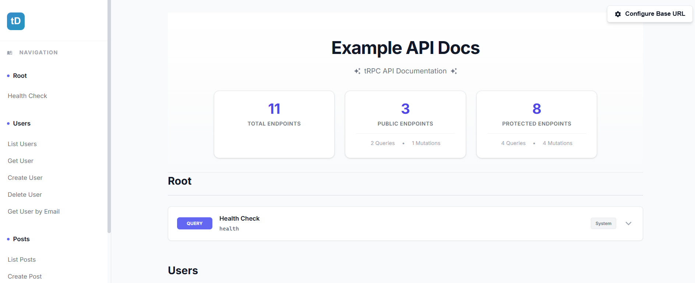
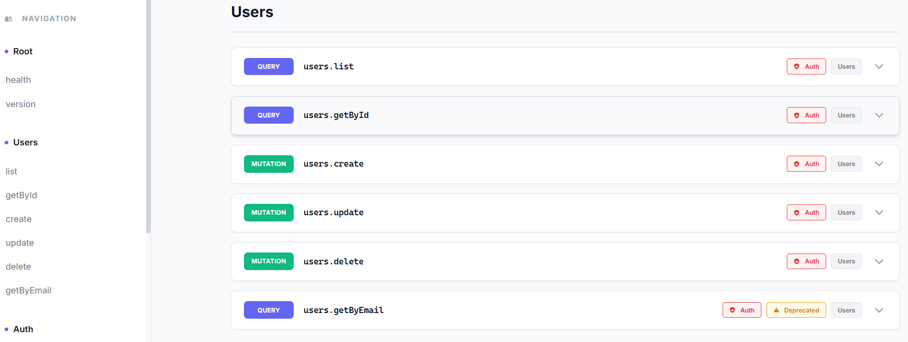
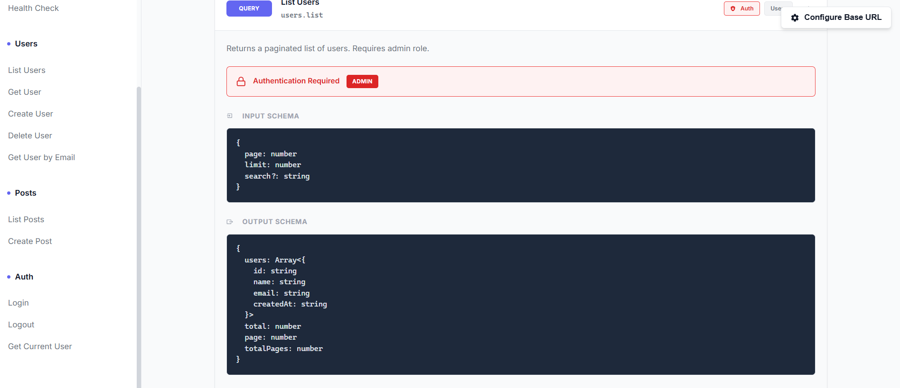

<div align="center">

<h1>
  
  <br/>
  tRPC Docs Generator
</h1>

<p><strong>Automatically generate beautiful, interactive documentation for your tRPC APIs</strong></p>

<p>
  <a href="https://www.npmjs.com/package/trpc-docs-generator">
    
  </a>
  <a href="LICENSE">
    
  </a>
  <a href="https://www.typescriptlang.org/">
    
  </a>
</p>

<p>
  <a href="#features">Features</a> •
  <a href="#installation">Installation</a> •
  <a href="#quick-start">Quick Start</a> •
  <a href="#api-reference">API Reference</a> •
  <a href="#examples">Examples</a>
</p>

</div>

<br/>

## Why tRPC Docs Generator?

Building great APIs is one thing documenting AND testing them shouldn't be hard. **tRPC Docs Generator** automatically creates stunning, **fully interactive** documentation from your tRPC router with zero configuration. Not only does it document your API, but it also provides a **built-in API testing playground** right in the browser!

- ⚡️ **Zero Config** - Works out of the box with any tRPC v11 router
- 🧪 **Interactive Testing** - **Test endpoints directly in the browser with live fetch requests**
- 🎨 **Beautiful UI** - Modern, responsive design with smooth animations
- 🔍 **Smart Schema Inference** - Automatically extracts types from Zod validators
- 📝 **Auto-Filled Examples** - Pre-filled JSON with required fields, click to add optional fields
- 🔐 **Header Management** - Add custom headers (auth tokens, etc.), save and reuse them
- 🌐 **Deploy Anywhere** - Works with Express, Next.js, Cloudflare Workers, and more

<br/>

## 📸 Screenshots

<div align="center">








</div>

<br/>

## Features

### 🧪 Interactive API Testing Playground

**THE FEATURE** - Test your API endpoints directly from the documentation:

- **Live Fetch Requests** - Send real HTTP requests to your API with a single click
- **Pre-filled Request Bodies** - JSON automatically populated with required fields from schemas
- **Optional Fields Manager** - Click badges to instantly add optional fields to your request
- **Custom Headers** - Add authentication tokens, content-types, and custom headers
- **Header Persistence** - Save common headers (like auth tokens) and reuse them across endpoints
- **Real-time Responses** - See formatted JSON responses with status codes and error details
- **Auto-Method Detection** - Uses GET for queries, POST for mutations automatically
- **Configurable Endpoint** - Point to localhost, staging, or production with one setting
- **Debug Information** - Shows full request details (URL, headers, body) on errors

### 🎯 Automatic Schema Extraction

Powered by Zod's `toJSONSchema()` method, the generator automatically:

- Extracts input/output schemas from your procedures
- Generates realistic JSON examples with proper types
- Creates TypeScript type definitions
- Identifies optional vs required fields
- Handles complex types (unions, intersections, arrays, enums)

### 🎨 Modern, Beautiful UI

- **Responsive Design** - Perfect on desktop, tablet, and mobile
- **Sidebar Navigation** - Organized by route groups with smooth scrolling
- **Expandable Cards** - Click to reveal detailed schema information
- **Type Badges** - Visual indicators for query/mutation/subscription
- **Auth & Role Badges** - Clearly shows protected routes and permissions
- **Deprecation Warnings** - Highlights deprecated endpoints
- **Dark-optimized Syntax** - Code blocks with syntax highlighting

### 📊 Smart Grouping

Routes are automatically organized by:

- **Tags** - Group related endpoints together
- **Procedure Type** - Separate queries, mutations, and subscriptions
- **Statistics** - See route counts at a glance

<br/>

## Installation

```bash
npm install trpc-docs-generator
```

**Requirements:**

- `@trpc/server` ^11.0.0
- Zod v4+ (with `toJSONSchema` support)

<br/>

## Quick Start

### Basic Usage

```typescript
import { collectRoutes, generateDocsHtml } from "trpc-docs-generator";
import { appRouter } from "./router";

// 1. Collect route information from your router
const routes = collectRoutes(appRouter);

// 2. Generate HTML documentation
const html = generateDocsHtml(routes, {
  title: "My API Documentation",
});

// 3. Serve it however you like
app.get("/docs", (req, res) => {
  res.send(html);
});
```

### Example Router

```typescript
import { initTRPC } from "@trpc/server";
import { z } from "zod";

const t = initTRPC.meta<RouteMeta>().create();

export const appRouter = t.router({
  // Query with metadata
  getUser: t.procedure
    .meta({
      name: "Get User",
      description: "Retrieve user information by ID",
      tags: ["Users"],
      auth: true,
    })
    .input(z.object({ userId: z.string() }))
    .output(
      z.object({
        id: z.string(),
        name: z.string(),
        email: z.string().email(),
      }),
    )
    .query(async ({ input }) => {
      // Implementation
    }),

  // Mutation example
  createPost: t.procedure
    .meta({
      name: "Create Post",
      description: "Create a new blog post",
      tags: ["Posts"],
      auth: true,
      roles: ["admin", "editor"],
    })
    .input(
      z.object({
        title: z.string(),
        content: z.string(),
        published: z.boolean().optional(),
      }),
    )
    .output(
      z.object({
        id: z.string(),
        title: z.string(),
        createdAt: z.string(),
      }),
    )
    .mutation(async ({ input }) => {
      // Implementation
    }),
});
```

<br/>

## 🧪 Testing Your API

Every endpoint in the generated docs includes a **fully functional testing panel**:

### How to Test Endpoints

1. **Open the docs** - Navigate to your `/docs` endpoint
2. **Configure base URL** - Click the gear icon (top-right) and enter your tRPC endpoint (e.g., `http://127.0.0.1:8787/trpc` see <a href="#troubleshooting">Troubleshooting</a>)
3. **Click any endpoint** - Expand the route card to see the testing panel
4. **Edit the request** - Pre-filled JSON is ready, modify as needed or click badges to add optional fields
5. **Add headers** (optional) - Add auth tokens or custom headers
6. **Click "Send Request"** - See real-time response!

### Header Management

```typescript
// Add custom headers for authenticated endpoints:
// 1. Click "Add Header" button
// 2. Enter: Authorization | Bearer your-token-here
// 3. Click "Save Headers" to persist for future requests
// 4. Use "Load Saved" on other endpoints to reuse headers
```

### Response Handling

The testing panel shows:

- ✅ **Success responses** - Green badge with formatted JSON
- ❌ **Error responses** - Red badge with error details and full request debug info
- 🔍 **Network errors** - Clear error messages with troubleshooting tips

<br/>

## Deployment Examples

### Express.js

```typescript
import express from "express";
import { collectRoutes, generateDocsHtml } from "trpc-docs-generator";
import { appRouter } from "./router";

const app = express();

app.get("/docs", (req, res) => {
  const routes = collectRoutes(appRouter);
  const html = generateDocsHtml(routes, {
    title: "My API Docs",
  });
  res.send(html);
});

app.listen(3000);
```

### Next.js (App Router)

```typescript
// app/docs/route.ts
import { collectRoutes, generateDocsHtml } from "trpc-docs-generator";
import { appRouter } from "@/server/router";

export async function GET() {
  const routes = collectRoutes(appRouter);
  const html = generateDocsHtml(routes, {
    title: "API Documentation",
  });

  return new Response(html, {
    headers: { "Content-Type": "text/html" },
  });
}

// Users accessing the docs will need to configure the base URL
// Example: http://localhost:3000/api/trpc (if your tRPC is at /api/trpc)
```

### Cloudflare Workers

```typescript
import { fetchRequestHandler } from "@trpc/server/adapters/fetch";
import { collectRoutes, generateDocsHtml } from "trpc-docs-generator";
import { appRouter } from "./router";

export default {
  async fetch(request: Request): Promise<Response> {
    const url = new URL(request.url);

    // Serve docs
    if (url.pathname === "/docs") {
      const routes = collectRoutes(appRouter);
      const html = generateDocsHtml(routes, {
        title: "API Documentation",
      });
      return new Response(html, {
        headers: { "Content-Type": "text/html" },
      });
    }

    // Handle tRPC requests
    return fetchRequestHandler({
      endpoint: "/trpc",
      req: request,
      router: appRouter,
    });
  },
};
```

<br/>

## Troubleshooting

### Testing Panel Issues

**"Failed to fetch" or CORS errors**:
- Ensure the base URL hostname matches exactly how you're accessing the docs
    - If docs are at `http://localhost:3000/docs`, use `http://localhost:3000/trpc`
    - Don't mix `localhost` and `127.0.0.1` - this causes origin mismatch
- Verify your tRPC server has CORS configured to allow requests from the docs origin
- Check browser console for specific CORS error messages

**404 Not Found**:
- Verify the complete mount path is included in base URL
    - If tRPC is at `/api/trpc`, use `http://localhost:3000/api/trpc`, not just `http://localhost:3000`
- Ensure your tRPC server is actually running
- Test the endpoint directly with curl or Postman to verify it works

**Base URL not saving**:
- Check browser console for localStorage errors
- Ensure you're using a modern browser with localStorage support
- Try clearing browser cache and reconfiguring

**Invalid JSON errors**:
- Ensure proper JSON syntax with double quotes for keys and string values
- Use the browser's JSON formatter or validator to check your input
- The testing panel validates JSON before sending

<br/>

## API Reference

### `collectRoutes(router: AnyRouter): RouteInfo[]`

Collects route information from a tRPC router by traversing all procedures.

**Parameters:**

- `router` - Your tRPC router instance

**Returns:**

- Array of `RouteInfo` objects containing:
  - `path` - Route path (e.g., `'users.getById'`)
  - `type` - Procedure type (`'query'` | `'mutation'` | `'subscription'`)
  - `meta` - Metadata object (if provided)
  - `inputSchema` - JSON schema for input (if Zod validator exists)
  - `outputSchema` - JSON schema for output (if Zod validator exists)
  - `inputExample` - Auto-generated JSON example of input
  - `outputExample` - Auto-generated JSON example of output
  - `inputTypeScript` - TypeScript type representation of input
  - `outputTypeScript` - TypeScript type representation of output
  - `inputOptionalFields` - List of optional input fields with examples
  - `outputOptionalFields` - List of optional output fields with examples

### `generateDocsHtml(routes: RouteInfo[], options?: DocsGeneratorOptions): string`

Generates a complete HTML documentation page from route information.

**Parameters:**

- `routes` - Array of route information from `collectRoutes()`
- `options` - Optional configuration:
  - `title` - Page title (default: `'API Documentation'`)

**Returns:**

- Complete HTML string ready to serve

### `RouteMeta` Type

Type definition for route metadata (use with `initTRPC.meta<RouteMeta>()`):

```typescript
type RouteMeta = {
  /** Human-readable name for the route */
  name?: string;
  /** Description of what the route does */
  description?: string;
  /** Tags for grouping routes */
  tags?: string[];
  /** Whether this route is deprecated */
  deprecated?: boolean;
  /** Whether this route requires authentication */
  auth?: boolean;
  /** Roles allowed to access this route */
  roles?: string[];
};
```

<br/>

## Examples

### Full Featured Router

```typescript
import { initTRPC } from "@trpc/server";
import { z } from "zod";
import type { RouteMeta } from "trpc-docs-generator";

const t = initTRPC.meta<RouteMeta>().create();

export const appRouter = t.router({
  // Public endpoint
  health: t.procedure
    .meta({
      name: "Health Check",
      description: "Check if the API is running",
      tags: ["System"],
    })
    .output(z.object({ status: z.literal("ok") }))
    .query(() => ({ status: "ok" as const })),

  // Protected endpoint
  users: t.router({
    list: t.procedure
      .meta({
        name: "List Users",
        description: "Get a paginated list of users",
        tags: ["Users"],
        auth: true,
        roles: ["admin"],
      })
      .input(
        z.object({
          page: z.number().min(1).default(1),
          limit: z.number().min(1).max(100).default(10),
          search: z.string().optional(),
        }),
      )
      .output(
        z.object({
          users: z.array(
            z.object({
              id: z.string(),
              name: z.string(),
              email: z.string().email(),
            }),
          ),
          total: z.number(),
          page: z.number(),
          totalPages: z.number(),
        }),
      )
      .query(async ({ input }) => {
        // Implementation
      }),

    // Deprecated endpoint
    getByEmail: t.procedure
      .meta({
        name: "Get User by Email",
        description: "Retrieve user by email address",
        tags: ["Users"],
        deprecated: true,
        auth: true,
      })
      .input(z.object({ email: z.string().email() }))
      .output(
        z.object({
          id: z.string(),
          name: z.string(),
          email: z.string(),
        }),
      )
      .query(async ({ input }) => {
        // Implementation
      }),
  }),
});

export type AppRouter = typeof appRouter;
```

### Complex Schemas

The generator handles complex Zod schemas:

```typescript
t.procedure.input(
  z.object({
    // Unions
    status: z.union([z.literal("active"), z.literal("inactive")]),
    // Enums
    role: z.enum(["admin", "user", "guest"]),
    // Intersections
    profile: z.object({ name: z.string() }).and(z.object({ age: z.number() })),
    // Arrays
    tags: z.array(z.string()),
    // Nested objects
    settings: z.object({
      notifications: z.object({
        email: z.boolean(),
        push: z.boolean(),
      }),
    }),
    // Optional fields
    metadata: z.record(z.string()).optional(),
  }),
);
```

<br/>

## How It Works

1. **Route Collection** - `collectRoutes()` traverses your tRPC router's internal structure to extract all procedures and their metadata

2. **Schema Inference** - Uses Zod's `toJSONSchema()` method (Zod v4+) to convert Zod validators into JSON Schema format

3. **Example Generation** - Automatically generates:
   - Realistic JSON examples from schemas
   - TypeScript type definitions
   - Lists of optional fields

4. **HTML Generation** - Creates a beautiful, self-contained HTML page with:
   - Embedded CSS (no external dependencies)
   - Interactive JavaScript for expandable cards and navigation
   - Responsive design
   - Organized sections and groups

<br/>

## Best Practices

### 1. Add Rich Metadata

```typescript
t.procedure.meta({
  name: "Create User", // Clear, readable name
  description: "Creates a new user account with the provided information",
  tags: ["Users", "Authentication"], // Logical grouping
  auth: true, // Show auth requirement
  roles: ["admin"], // Show role requirements
});
```

### 2. Mark Deprecated Routes

```typescript
t.procedure.meta({
  deprecated: true,
  description: "Use users.getById instead",
});
```

### 3. Group Related Routes with Tags

```typescript
const appRouter = t.router({
  // All auth-related routes
  login: t.procedure.meta({ tags: ["Authentication"] }),
  logout: t.procedure.meta({ tags: ["Authentication"] }),
  register: t.procedure.meta({ tags: ["Authentication"] }),

  // All user-related routes
  getUser: t.procedure.meta({ tags: ["Users"] }),
  updateUser: t.procedure.meta({ tags: ["Users"] }),
  deleteUser: t.procedure.meta({ tags: ["Users"] }),
});
```

<br/>

## TypeScript Support

Fully typed with TypeScript! Import types for better developer experience:

```typescript
import type {
  RouteMeta,
  RouteInfo,
  DocsGeneratorOptions,
} from "trpc-docs-generator";
```

<br/>

## Contributing

Contributions are welcome! Please feel free to submit a Pull Request.

<br/>

## License

MIT © Lior Cohen

<br/>

---

<div align="center">
  <sub>Built with ❤️ for the tRPC community</sub>
</div>
