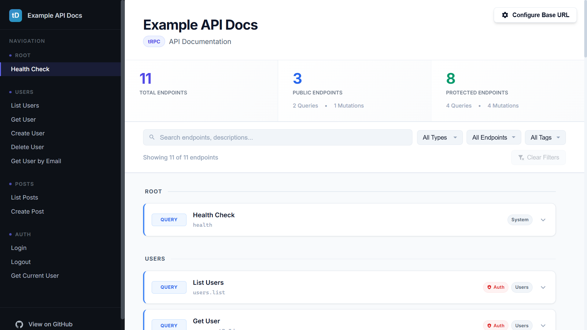
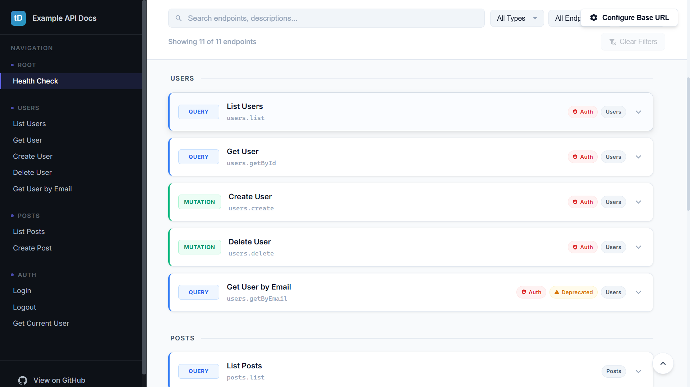
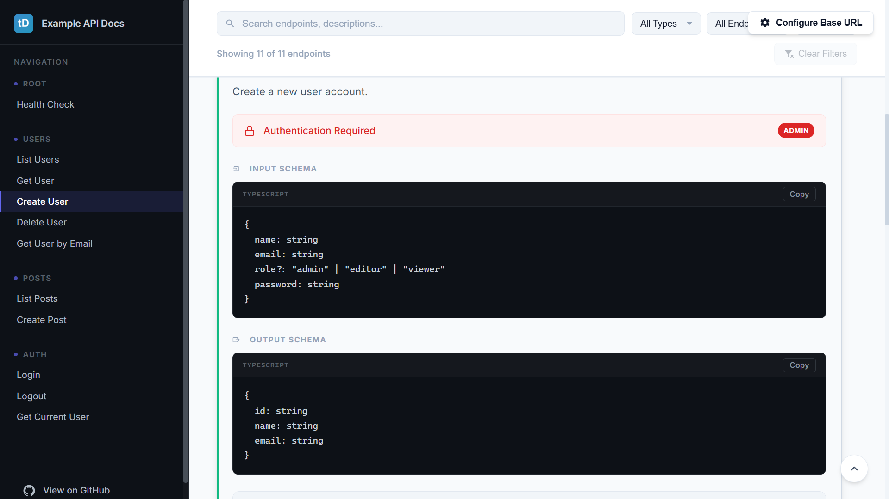
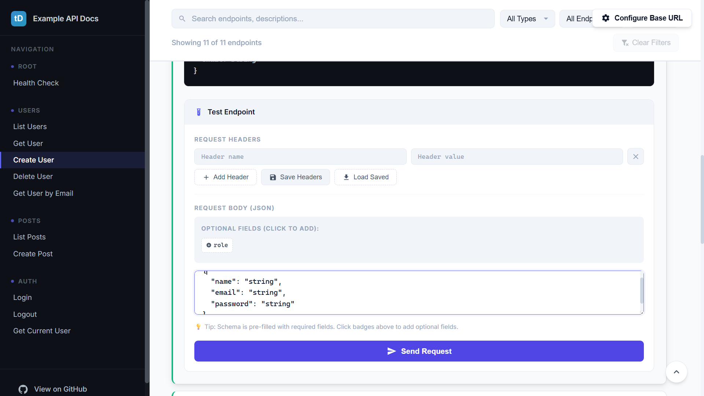

<div align="center">

<h1>
  
  <br/>
  tRPC Docs Generator
</h1>

<p><strong>Automatically generate beautiful, interactive documentation for your tRPC APIs</strong></p>

<p>
  <a href="https://www.npmjs.com/package/trpc-docs-generator">
    
  </a>
  <a href="LICENSE">
    
  </a>
  <a href="https://www.typescriptlang.org/">
    
  </a>
</p>

<p>
  <a href="#features">Features</a> •
  <a href="#installation">Installation</a> •
  <a href="#quick-start">Quick Start</a> •
  <a href="#api-reference">API Reference</a> •
  <a href="#examples">Examples</a>
</p>

</div>

<br/>

## Why tRPC Docs Generator?

Building great APIs is one thing documenting AND testing them shouldn't be hard. **tRPC Docs
Generator** automatically creates stunning, **fully interactive** documentation from your tRPC
router with zero configuration. Not only does it document your API, but it also provides a
**built-in API testing playground** right in the browser!

- ⚡️ **Zero Config** - Works out of the box with any tRPC v11 router
- 🧪 **Interactive Testing** - **Test endpoints directly in the browser with live fetch requests**
- 🔍 **Search & Filter** - Instantly find endpoints with real-time search and smart filters
- 🎨 **Beautiful UI** - Modern, responsive design with smooth animations
- 🧠 **Smart Schema Inference** - Automatically extracts types from Zod validators
- 📝 **Auto-Filled Examples** - Pre-filled JSON with required fields, click to add optional fields
- 🔐 **Header Management** - Add custom headers (auth tokens, etc.), save and reuse them
- 📋 **Ready-to-Copy Snippets** - cURL, fetch, and tRPC client code generated for every endpoint
- ✅ **Response Validation** - Live responses checked against the documented output schema
- 🕘 **Request History** - Past requests saved per endpoint, replay any of them with one click
- 🌐 **Deploy Anywhere** - Works with Express, Next.js, Cloudflare Workers, and more

<br/>

## 📸 Screenshots

<div align="center">









</div>

<br/>

## Features

### 🧪 Interactive API Testing Playground

**THE FEATURE** - Test your API endpoints directly from the documentation:

- **Live Fetch Requests** - Send real HTTP requests to your API with a single click
- **Pre-filled Request Bodies** - JSON automatically populated with required fields from schemas
- **Optional Fields Manager** - Click badges to instantly add optional fields to your request
- **Custom Headers** - Add authentication tokens, content-types, and custom headers
- **Header Persistence** - Save common headers (like auth tokens) and reuse them across endpoints
- **Real-time Responses** - See formatted JSON responses with status codes and error details
- **Auto-Method Detection** - Uses GET for queries, POST for mutations automatically
- **Configurable Endpoint** - Point to localhost, staging, or production with one setting
- **Debug Information** - Shows full request details (URL, headers, body) on errors

### 🎯 Automatic Schema Extraction

Powered by Zod's `toJSONSchema()` method, the generator automatically:

- Extracts input/output schemas from your procedures
- Generates realistic JSON examples with proper types
- Creates TypeScript type definitions
- Identifies optional vs required fields
- Handles complex types (unions, intersections, arrays, enums, records)
- **Date fields** - `z.date()` and `z.coerce.date()` are represented as ISO 8601 strings
  (`{ type: "string", format: "date-time" }`), matching how tRPC transports dates over the wire
- **Field Descriptions** - `.describe()` text on Zod schemas is preserved as an inline `// comment`
  in the generated TypeScript output

### 📋 Code Snippets (cURL, fetch, tRPC Client)

Every endpoint includes ready-to-copy code snippets in three formats, generated from the same
example data used to pre-fill the test panel:

- **cURL** - shell command with proper query-string encoding for GET requests
- **fetch** - plain `fetch()` snippet for browsers or Node
- **tRPC Client** - typed `@trpc/client` call using `createTRPCClient`
- Automatically respects the `superjson` transformer option, wrapping payloads in `{ json: ... }`
  when enabled
- Also available programmatically via `generateSnippets()`, `generateCurlSnippet()`,
  `generateFetchSnippet()`, and `generateTrpcClientSnippet()`

### ✅ Response Schema Validation

After sending a test request, the response is automatically checked against the route's documented
output schema:

- ✅ Green confirmation when the response matches the schema
- ⚠️ A list of specific mismatches (missing fields, wrong types, disallowed values) when it doesn't
- Powered by the standalone `validateAgainstSchema()` export, usable outside the generated docs too

### 🕘 Request History

Every endpoint keeps a local history of its test requests:

- Automatically records the timestamp, input, and response status for each request you send
- Click any past entry to replay it - refills the request panel with that entry's input
- Scrollable item list with an always-visible "Clear history" button
- Stored in `localStorage`, scoped per route

### 🔍 Search & Filter System

Quickly find what you need in large APIs:

- **Real-time Search** - Filter endpoints by name, path, description, or tags as you type
- **Smart Filters** - Filter by type (query/mutation), auth status (public/protected), or custom
  tags
- **Filter Persistence** - Your filter selections are saved across page reloads
- **Visual Feedback** - Active filters highlighted in blue, clear button turns red when active
- **Dynamic Results** - Shows count of visible endpoints and auto-hides empty sections

### 🎨 Modern, Beautiful UI

- **Responsive Design** - Perfect on desktop, tablet, and mobile
- **Sidebar Navigation** - Organized by route groups with smooth scrolling
- **Expandable Cards** - Click to reveal detailed schema information
- **Type Badges** - Visual indicators for query/mutation/subscription
- **Auth & Role Badges** - Clearly shows protected routes and permissions
- **Deprecation Warnings** - Highlights deprecated endpoints
- **Dark-optimized Syntax** - Code blocks with syntax highlighting

### 📊 Smart Grouping

Routes are automatically organized by:

- **Tags** - Group related endpoints together
- **Procedure Type** - Separate queries, mutations, and subscriptions
- **Statistics** - See route counts at a glance

<br/>

## Installation

```bash
bun install trpc-docs-generator
# or
npm install trpc-docs-generator
```

**Requirements:**

- `@trpc/server` ^11.0.0
- Zod v4+ (with `toJSONSchema` support)
- Node.js 16+ (with native ESM support)

**Note:** This package uses native ESM with explicit `.js` file extensions in imports, ensuring
compatibility with Node.js native module resolution (Node 16+, Node 22+).

<br/>

## Quick Start

### Basic Usage

```typescript
import { collectRoutes, generateDocsHtml } from 'trpc-docs-generator';
import { appRouter } from './router';

// 1. Collect route information from your router
const routes = collectRoutes(appRouter);

// 2. Generate HTML documentation
const html = generateDocsHtml(routes, {
  title: 'My API Documentation'
});

// 3. Serve it however you like
app.get('/docs', (req, res) => {
  res.send(html);
});
```

### Example Router

```typescript
import { initTRPC } from '@trpc/server';
import { z } from 'zod';

const t = initTRPC.meta<RouteMeta>().create();

export const appRouter = t.router({
  // Query with metadata
  getUser: t.procedure
    .meta({
      name: 'Get User',
      docs: {
        description: 'Retrieve user information by ID',
        tags: ['Users'],
        auth: true
      }
    })
    .input(z.object({ userId: z.string() }))
    .output(
      z.object({
        id: z.string(),
        name: z.string(),
        email: z.string().email()
      })
    )
    .query(async ({ input }) => {
      // Implementation
    }),

  // Mutation example
  createPost: t.procedure
    .meta({
      name: 'Create Post',
      docs: {
        description: 'Create a new blog post',
        tags: ['Posts'],
        auth: true,
        roles: ['admin', 'editor']
      }
    })
    .input(
      z.object({
        title: z.string(),
        content: z.string(),
        published: z.boolean().optional()
      })
    )
    .output(
      z.object({
        id: z.string(),
        title: z.string(),
        createdAt: z.string()
      })
    )
    .mutation(async ({ input }) => {
      // Implementation
    })
});
```

<br/>

## 🧪 Testing Your API

Every endpoint in the generated docs includes a **fully functional testing panel**:

### How to Test Endpoints

1. **Open the docs** - Navigate to your `/docs` endpoint
2. **Configure base URL** - Click the gear icon (top-right) and enter your tRPC endpoint (e.g.,
   `http://127.0.0.1:8787/trpc` see <a href="#troubleshooting">Troubleshooting</a>)
3. **Click any endpoint** - Expand the route card to see the testing panel
4. **Edit the request** - Pre-filled JSON is ready, modify as needed or click badges to add optional
   fields
5. **Add headers** (optional) - Add auth tokens or custom headers
6. **Click "Send Request"** - See real-time response!

### Header Management

```typescript
// Add custom headers for authenticated endpoints:
// 1. Click "Add Header" button
// 2. Enter: Authorization | Bearer your-token-here
// 3. Click "Save Headers" to persist for future requests
// 4. Use "Load Saved" on other endpoints to reuse headers
```

### Response Handling

The testing panel shows:

- ✅ **Success responses** - Green badge with formatted JSON
- ❌ **Error responses** - Red badge with error details and full request debug info
- 🔍 **Network errors** - Clear error messages with troubleshooting tips

<br/>

## Deployment Examples

### Express.js

```typescript
import express from 'express';
import { collectRoutes, generateDocsHtml } from 'trpc-docs-generator';
import { appRouter } from './router';

const app = express();

app.get('/docs', (req, res) => {
  const routes = collectRoutes(appRouter);
  const html = generateDocsHtml(routes, {
    title: 'My API Docs'
  });
  res.send(html);
});

app.listen(3000);
```

### Next.js (App Router)

```typescript
// app/docs/route.ts
import { collectRoutes, generateDocsHtml } from 'trpc-docs-generator';
import { appRouter } from '@/server/router';

export async function GET() {
  const routes = collectRoutes(appRouter);
  const html = generateDocsHtml(routes, {
    title: 'API Documentation'
  });

  return new Response(html, {
    headers: { 'Content-Type': 'text/html' }
  });
}

// Users accessing the docs will need to configure the base URL
// Example: http://localhost:3000/api/trpc (if your tRPC is at /api/trpc)
```

### Cloudflare Workers

```typescript
import { fetchRequestHandler } from '@trpc/server/adapters/fetch';
import { collectRoutes, generateDocsHtml } from 'trpc-docs-generator';
import { appRouter } from './router';

export default {
  async fetch(request: Request): Promise<Response> {
    const url = new URL(request.url);

    // Serve docs
    if (url.pathname === '/docs') {
      const routes = collectRoutes(appRouter);
      const html = generateDocsHtml(routes, {
        title: 'API Documentation'
      });
      return new Response(html, {
        headers: { 'Content-Type': 'text/html' }
      });
    }

    // Handle tRPC requests
    return fetchRequestHandler({
      endpoint: '/trpc',
      req: request,
      router: appRouter
    });
  }
};
```

<br/>

## Troubleshooting

### Testing Panel Issues

**"Failed to fetch" or CORS errors**:

- Ensure the base URL hostname matches exactly how you're accessing the docs
  - If docs are at `http://localhost:3000/docs`, use `http://localhost:3000/trpc`
  - Don't mix `localhost` and `127.0.0.1` - this causes origin mismatch
- Verify your tRPC server has CORS configured to allow requests from the docs origin
- Check browser console for specific CORS error messages

**404 Not Found**:

- Verify the complete mount path is included in base URL
  - If tRPC is at `/api/trpc`, use `http://localhost:3000/api/trpc`, not just
    `http://localhost:3000`
- Ensure your tRPC server is actually running
- Test the endpoint directly with curl or Postman to verify it works

**Base URL not saving**:

- Check browser console for localStorage errors
- Ensure you're using a modern browser with localStorage support
- Try clearing browser cache and reconfiguring

**Invalid JSON errors**:

- Ensure proper JSON syntax with double quotes for keys and string values
- Use the browser's JSON formatter or validator to check your input
- The testing panel validates JSON before sending

<br/>

## API Reference

### `collectRoutes(router: AnyRouter): RouteInfo[]`

Collects route information from a tRPC router by traversing all procedures.

**Parameters:**

- `router` - Your tRPC router instance

**Returns:**

- Array of `RouteInfo` objects containing:
  - `path` - Route path (e.g., `'users.getById'`)
  - `type` - Procedure type (`'query'` | `'mutation'` | `'subscription'`)
  - `meta` - Metadata object (if provided)
  - `inputSchema` - JSON schema for input (if Zod validator exists)
  - `outputSchema` - JSON schema for output (if Zod validator exists)
  - `inputExample` - Auto-generated JSON example of input
  - `outputExample` - Auto-generated JSON example of output
  - `inputTypeScript` - TypeScript type representation of input
  - `outputTypeScript` - TypeScript type representation of output
  - `inputOptionalFields` - List of optional input fields with examples
  - `outputOptionalFields` - List of optional output fields with examples

### `generateDocsHtml(routes: RouteInfo[], options?: DocsGeneratorOptions): string`

Generates a complete HTML documentation page from route information.

**Parameters:**

- `routes` - Array of route information from `collectRoutes()`
- `options` - Optional configuration:
  - `title` - Page title (default: `'API Documentation'`)
  - `transformer` - Data transformer used by tRPC router (optional)
    - Set to `'superjson'` if your router uses the superjson transformer
    - This ensures the test playground correctly wraps requests/responses in `{json: ...}` format
    - See [SuperJSON Support](#superjson-support) for details

**Returns:**

- Complete HTML string ready to serve

### `generateSnippets(route: RouteInfo, options?: SnippetOptions): RouteSnippets`

Generates ready-to-copy code snippets (cURL, fetch, and tRPC client) for a single route. Individual
generators are also exported: `generateCurlSnippet()`, `generateFetchSnippet()`, and
`generateTrpcClientSnippet()` (each returns a `string`).

**Parameters:**

- `route` - A single `RouteInfo` object (e.g. from `collectRoutes()`)
- `options` - Optional configuration:
  - `transformer` - Set to `'superjson'` to wrap payloads in `{ json: ... }`
  - `baseUrlPlaceholder` - Token used in place of the real base URL (default `'{{BASE_URL}}'`)

**Returns:**

- `RouteSnippets` - `{ curl: string; fetch: string; trpcClient: string }`

### `validateAgainstSchema(data: unknown, schema: JSONSchema, path?: string): string[]`

Validates arbitrary data against a JSON Schema object (as produced by `collectRoutes()`), returning
an array of human-readable mismatch descriptions. An empty array means `data` matches the schema.
Used internally to validate live responses in the test playground; also exported for standalone use.

### `RouteMeta` Type

Type definition for route metadata (use with `initTRPC.meta<RouteMeta>()`):

```typescript
type RouteMeta = {
  /** Human-readable name for the route */
  name?: string;
  /** Documentation metadata */
  docs?: {
    /** Description of what the route does */
    description?: string;
    /** Tags for grouping routes */
    tags?: string[];
    /** Whether this route is deprecated */
    deprecated?: boolean;
    /** Whether this route requires authentication */
    auth?: boolean;
    /** Roles allowed to access this route */
    roles?: string[];
  };
};
```

<br/>

## SuperJSON Support

If your tRPC router uses the [superjson transformer](https://trpc.io/docs/data-transformers), you
need to configure the docs generator to match. SuperJSON wraps requests/responses in a special
format (`{json: ...}`) to support JavaScript types that standard JSON doesn't handle (Date,
undefined, BigInt, Map, Set, etc.).

### Usage with SuperJSON

```typescript
import { initTRPC } from '@trpc/server';
import superjson from 'superjson';
import { collectRoutes, generateDocsHtml } from 'trpc-docs-generator';

// Your tRPC router with superjson transformer
const t = initTRPC.create({
  transformer: superjson // Using superjson
});

const appRouter = t.router({
  getEvent: t.procedure.input(z.object({ id: z.string() })).query(() => ({
    id: '123',
    name: 'Conference',
    startDate: new Date() // Date objects work with superjson!
  }))
});

// Generate docs WITH superjson support
const routes = collectRoutes(appRouter);
const html = generateDocsHtml(routes, {
  title: 'My API Documentation',
  transformer: 'superjson' // Enable superjson in test playground
});
```

### What This Does

**Without** `transformer: 'superjson'`:

- Request: `{"id": "123"}`
- Your superjson-enabled tRPC server expects: `{"json": {"id": "123"}}`
- Result: ❌ **Request fails** with "Invalid input: expected object, received undefined"

**With** `transformer: 'superjson'`:

- Request: `{"json": {"id": "123"}}`
- Response unwrapping: Automatically extracts data from `{result: {data: {json: {...}}}}`
- Result: ✅ **Everything works perfectly**

### When to Use

Enable `transformer: 'superjson'` if your tRPC router:

- Uses `superjson` transformer in `initTRPC.create({ transformer: superjson })`
- Returns Date objects, undefined values, BigInt, Map, Set, or other non-JSON types
- Is configured with any custom transformer that wraps data

If you're using standard JSON (no transformer), you don't need this option.

<br/>

## Examples

### Full Featured Router

```typescript
import { initTRPC } from '@trpc/server';
import { z } from 'zod';
import type { RouteMeta } from 'trpc-docs-generator';

const t = initTRPC.meta<RouteMeta>().create();

export const appRouter = t.router({
  // Public endpoint
  health: t.procedure
    .meta({
      name: 'Health Check',
      docs: {
        description: 'Check if the API is running',
        tags: ['System']
      }
    })
    .output(z.object({ status: z.literal('ok') }))
    .query(() => ({ status: 'ok' as const })),

  // Protected endpoint
  users: t.router({
    list: t.procedure
      .meta({
        name: 'List Users',
        docs: {
          description: 'Get a paginated list of users',
          tags: ['Users'],
          auth: true,
          roles: ['admin']
        }
      })
      .input(
        z.object({
          page: z.number().min(1).default(1),
          limit: z.number().min(1).max(100).default(10),
          search: z.string().optional()
        })
      )
      .output(
        z.object({
          users: z.array(
            z.object({
              id: z.string(),
              name: z.string(),
              email: z.string().email()
            })
          ),
          total: z.number(),
          page: z.number(),
          totalPages: z.number()
        })
      )
      .query(async ({ input }) => {
        // Implementation
      }),

    // Deprecated endpoint
    getByEmail: t.procedure
      .meta({
        name: 'Get User by Email',
        docs: {
          description: 'Retrieve user by email address',
          tags: ['Users'],
          deprecated: true,
          auth: true
        }
      })
      .input(z.object({ email: z.string().email() }))
      .output(
        z.object({
          id: z.string(),
          name: z.string(),
          email: z.string()
        })
      )
      .query(async ({ input }) => {
        // Implementation
      })
  })
});

export type AppRouter = typeof appRouter;
```

### Complex Schemas

The generator handles complex Zod schemas:

```typescript
t.procedure.input(
  z.object({
    // Unions
    status: z.union([z.literal('active'), z.literal('inactive')]),
    // Enums
    role: z.enum(['admin', 'user', 'guest']),
    // Intersections
    profile: z.object({ name: z.string() }).and(z.object({ age: z.number() })),
    // Arrays
    tags: z.array(z.string()),
    // Nested objects
    settings: z.object({
      notifications: z.object({
        email: z.boolean(),
        push: z.boolean()
      })
    }),
    // Records (key-value maps)
    metadata: z.record(z.string(), z.string()).optional()
    // Alternative: record with any string value
    // metadata: z.record(z.string()).optional(),
  })
);
```

<br/>

## How It Works

1. **Route Collection** - `collectRoutes()` traverses your tRPC router's internal structure to
   extract all procedures and their metadata

2. **Schema Inference** - Uses Zod's `toJSONSchema()` method (Zod v4+) to convert Zod validators
   into JSON Schema format

3. **Example Generation** - Automatically generates:
   - Realistic JSON examples from schemas
   - TypeScript type definitions
   - Lists of optional fields

4. **HTML Generation** - Creates a beautiful, self-contained HTML page with:
   - Embedded CSS (no external dependencies)
   - Interactive JavaScript for expandable cards and navigation
   - Responsive design
   - Organized sections and groups

<br/>

## Best Practices

### 1. Add Rich Metadata

```typescript
t.procedure.meta({
  name: 'Create User', // Clear, readable name
  docs: {
    description: 'Creates a new user account with the provided information',
    tags: ['Users', 'Authentication'], // Logical grouping
    auth: true, // Show auth requirement
    roles: ['admin'] // Show role requirements
  }
});
```

### 2. Mark Deprecated Routes

```typescript
t.procedure.meta({
  docs: {
    deprecated: true,
    description: 'Use users.getById instead'
  }
});
```

### 3. Group Related Routes with Tags

```typescript
const appRouter = t.router({
  // All auth-related routes
  login: t.procedure.meta({ docs: { tags: ['Authentication'] } }),
  logout: t.procedure.meta({ docs: { tags: ['Authentication'] } }),
  register: t.procedure.meta({ docs: { tags: ['Authentication'] } }),

  // All user-related routes
  getUser: t.procedure.meta({ docs: { tags: ['Users'] } }),
  updateUser: t.procedure.meta({ docs: { tags: ['Users'] } }),
  deleteUser: t.procedure.meta({ docs: { tags: ['Users'] } })
});
```

<br/>

## TypeScript Support

Fully typed with TypeScript! Import types for better developer experience:

```typescript
import type { RouteMeta, RouteInfo, DocsGeneratorOptions } from 'trpc-docs-generator';
```

<br/>

## Development

### Generating a Preview

To generate a standalone HTML preview for testing the documentation output:

```bash
bun scripts/generate-preview.ts
```

This creates `preview.html` in the root directory with example routes. Open it in your browser to
see the generated documentation without setting up a server.

The preview script includes a comprehensive example router with various features like
authentication, roles, deprecated endpoints, and different schema types.

<br/>

## Contributing

Contributions are welcome! Please feel free to submit a Pull Request.

<br/>

## License

MIT © Lior Cohen

<br/>

---

<div align="center">
  <sub>Built with ❤️ for the tRPC community</sub>
</div>
